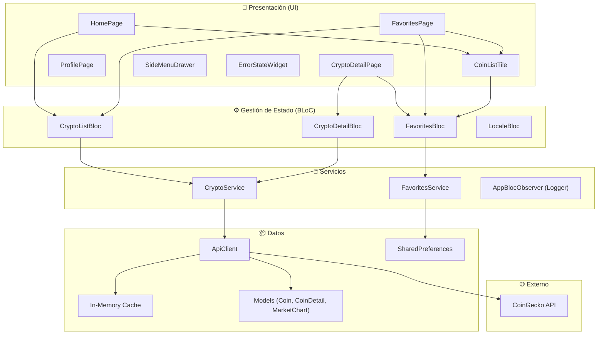
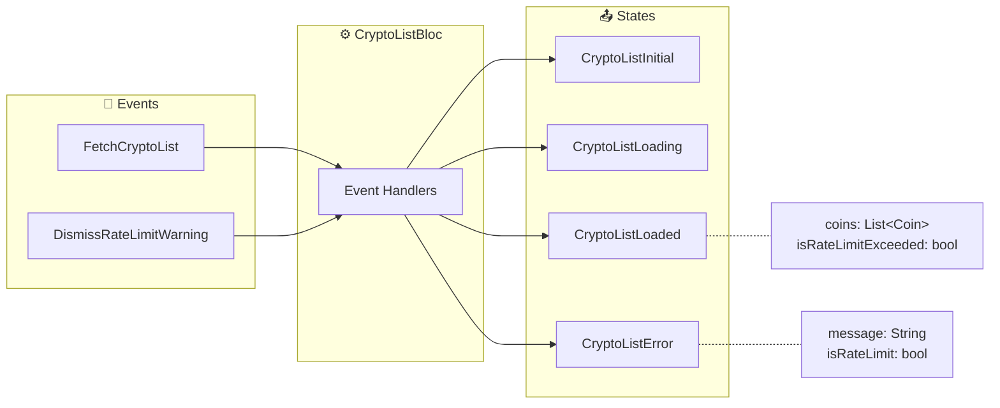
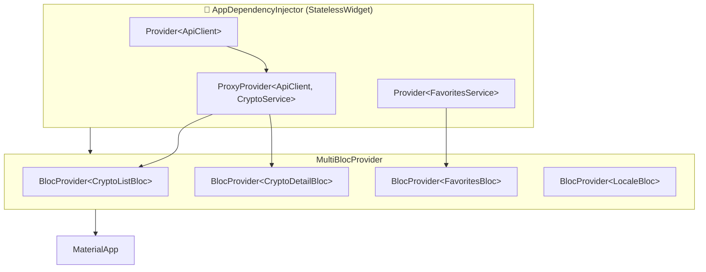
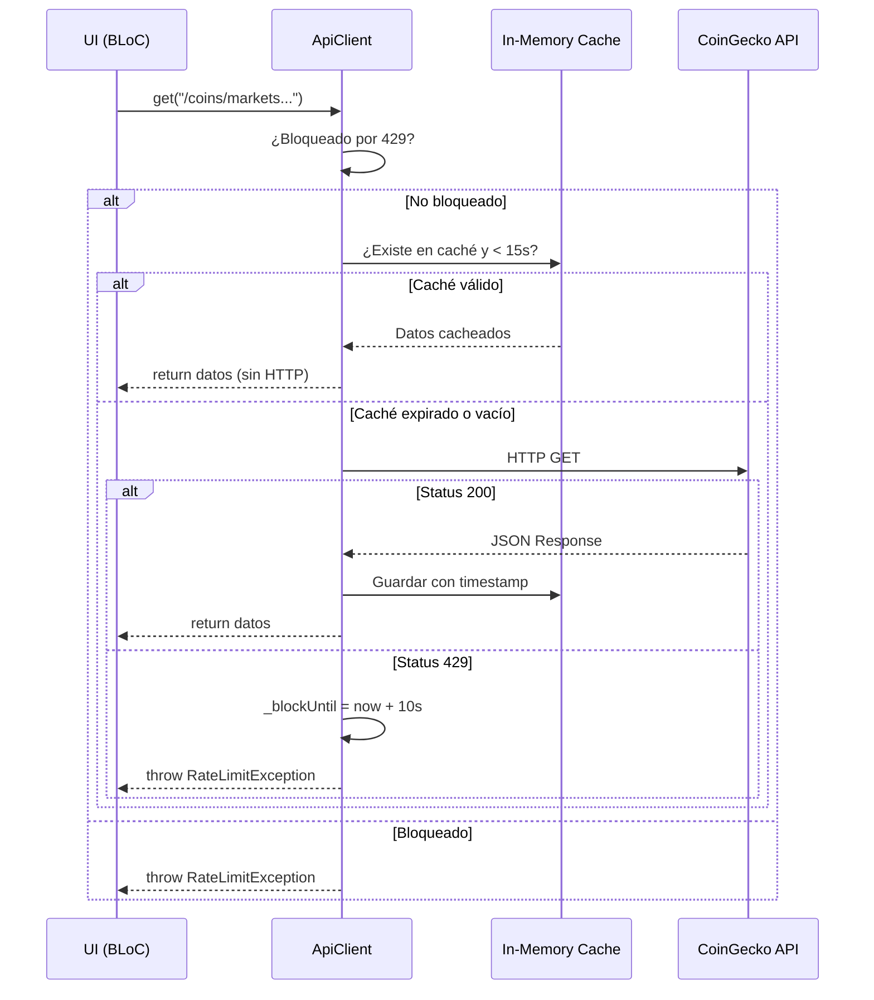
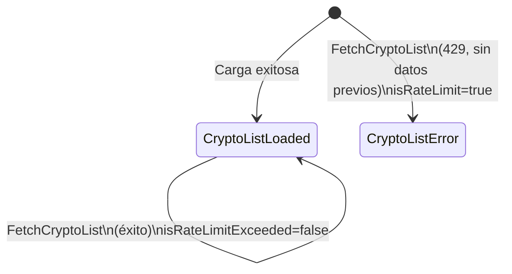
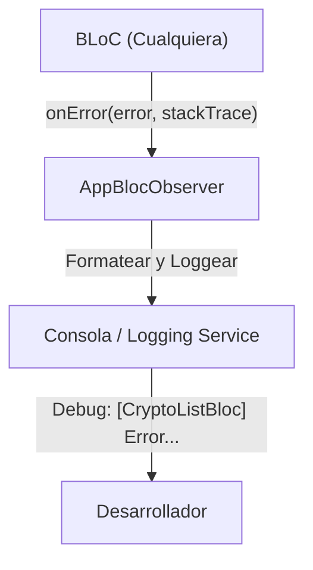
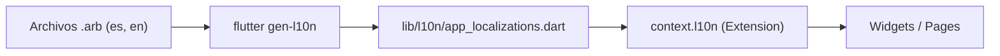
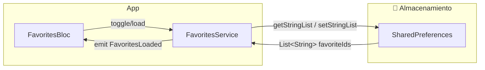
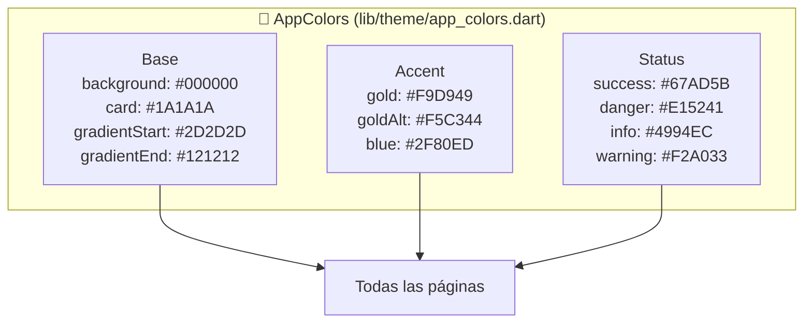
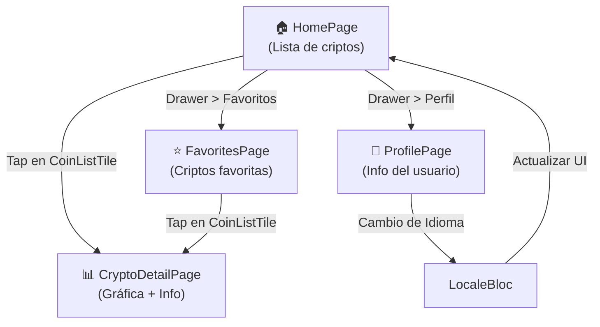

# crypto_tracker_lite

Una aplicación móvil built con **Flutter** que permite rastrear precios de criptomonedas en tiempo real, ver gráficas históricas, gestionar favoritos y cambiar idioma entre español e inglés.

---

## ✨ Características Principales

- 📊 **Lista de criptomonedas** con precios actualizados y cambio porcentual
- 📈 **Gráficas históricas** de 7 días para cada criptomoneda
- ⭐ **Gestión de favoritos** (persistencia local con SharedPreferences)
- 🌍 **Soporte multi-idioma** (ES/EN)
- 🎨 **UI moderna y responsiva** con tema oscuro
- 🛡️ **Manejo elegante de límites de API** (HTTP 429) sin pérdida de datos
- 🔄 **Caché en memoria** para optimizar llamadas repetidas
- 📱 **Arquitectura limpia** con BLoC Pattern

Video demo: https://www.loom.com/share/fced771096cf4ab7b079e42c60bb1b08
---

## 🏗️ Stack Técnico

- **Framework:** Flutter
- **Gestión de Estado:** BLoC Pattern
- **HTTP Client:** http package + caché custom
- **Persistencia Local:** SharedPreferences
- **API:** CoinGecko API (gratuita)
- **Gráficas:** FL Chart
- **DI:** Provider

---

## ⚡ Instrucciones Rápidas

### Requisitos previos

- Flutter 3.13+
- Dart 3.0+
- Xcode (iOS) o Android Studio (Android)

### Instalación y ejecución

```bash
# 1. Clonar el repositorio
git clone <repo-url>
cd crypto_tracker_lite

# 2. Instalar dependencias
flutter pub get

# 3. Generar código (l10n, BLoC, etc)
flutter gen-l10n
flutter pub run build_runner build

# 4. Ejecutar en emulador o dispositivo
flutter run

# Para ejecutar en modo release
flutter run --release
```

### Ejecutar tests

```bash
# Tests unitarios
flutter test

# Con cobertura (requiere lcov)
flutter test --coverage
```

---

## Screenshots

<table>
  <tr>
    <td align="center">
      <strong>Home</strong><br>
      Lista de criptomonedas con precios, cambio 24h y refresh<br><br>
      
    </td>
    <td align="center">
      <strong>Detalle</strong><br>
      Gráfica histórica (7 días), info y botón de favorito<br><br>
      
    </td>
  </tr>

  <tr>
    <td align="center">
      <strong>Menú</strong><br>
      Drawer con info de usuario y cambio de idioma (ES/EN)<br><br>
      
    </td>
    <td align="center">
      <strong>Favoritos</strong><br>
      Lista de monedas marcadas como favoritas<br><br>
      
    </td>
  </tr>

  <tr>
    <td align="center">
      <strong>Perfil</strong><br>
      Cambio de idioma (ES/EN) y configuración<br><br>
      
    </td>
    <td align="center">
      <strong>Rate Limit</strong><br>
      Banner cuando se activa el error HTTP 429<br><br>
      
    </td>
  </tr>
</table>

---

# 🏗️ Arquitectura y Patrones — CryptoTracker Lite

Documentación completa de los patrones de diseño y la arquitectura utilizada en el proyecto.

---

## 1. Estructura de Carpetas (Layered Architecture)

```
lib/
├── api/                  # Capa de Red
│   ├── api_client.dart       # Cliente HTTP + Caché en memoria + Rate Limit
│   └── exceptions.dart       # Excepciones personalizadas (RateLimitException)
├── models/               # Capa de Datos
│   ├── coin.dart             # Modelo de moneda (lista)
│   ├── coin_detail.dart      # Modelo de detalle
│   └── market_chart.dart     # Modelo de gráfica histórica
├── services/             # Capa de Lógica de Negocio
│   ├── crypto_service.dart   # Orquestador de llamadas API → Modelos
│   └── favorites_service.dart# Persistencia local (SharedPreferences)
├── bloc/                 # Capa de Gestión de Estado
│   ├── crypto_list_bloc.dart # BLoC: Lista principal + Rate Limit
│   ├── crypto_detail_bloc.dart # BLoC: Detalle + Gráfica
│   ├── favorites_bloc.dart   # BLoC: Favoritos (toggle/load)
│   └── locale_bloc.dart      # BLoC: Internacionalización (idiomas)
├── l10n/                 # Localización (i18n)
│   ├── app_es.arb            # Traducciones al español
│   ├── app_en.arb            # Traducciones al inglés
│   └── app_localizations.dart# Clase generada + Extensión context.l10n
├── providers/            # Capa de Inyección de Dependencias
│   └── dependency_injection.dart # Widget AppDependencyInjector
├── pages/                # Capa de Presentación (Pantallas)
│   ├── home_page.dart
│   ├── crypto_detail_page.dart
│   ├── favorites_page.dart
│   └── profile_page.dart
├── widgets/              # Capa de Presentación (Componentes reutilizables)
│   ├── coin_list_tile.dart
│   ├── side_menu_drawer.dart
│   ├── rate_limit_banner.dart # Banner global de 429
│   └── error_state_widget.dart# Pantalla de error unificada
├── theme/                # Sistema de Diseño
│   └── app_colors.dart       # Design Tokens (paleta de colores centralizada)
├── app_bloc_observer.dart    # Logging global de errores y transiciones
└── main.dart             # Punto de entrada
```

---

## 2. Diagrama General de Arquitectura



---

## 3. Patrón BLoC (Business Logic Component)



### Todos los BLoCs del proyecto:

| BLoC                 | Events                                       | States                                                                                    |
| -------------------- | -------------------------------------------- | ----------------------------------------------------------------------------------------- |
| **CryptoListBloc**   | `FetchCryptoList`, `DismissRateLimitWarning` | `Initial`, `Loading`, `Loaded(coins, isRateLimitExceeded)`, `Error(message, isRateLimit)` |
| **CryptoDetailBloc** | `FetchCryptoDetail(id)`                      | `Initial`, `Loading`, `Loaded(chart, detail)`, `Error(message, isRateLimit)`              |
| **FavoritesBloc**    | `LoadFavorites`, `ToggleFavorite(coinId)`    | `FavoritesLoaded(favoriteIds)`                                                            |
| **LocaleBloc**       | `ChangeLocale(locale)`                       | `LocaleState(locale)`                                                                     |

---

## 4. Inyección de Dependencias (Provider Pattern)



> [!IMPORTANT]
> **Regla estricta del proyecto:** `Provider` se usa **exclusivamente** para inyección de dependencias (servicios). Toda la lógica de estado se maneja con `BLoC`.

---

## 5. Sistema de Caché In-Memory



---

## 6. Flujo de Manejo del Error 429 (Rate Limit)



> [!NOTE]
> **Comportamiento clave:** Si ya tenemos monedas cargadas y llega un 429, **no perdemos los datos**. Simplemente mostramos un banner naranja (`AppColors.warning`) sobre la lista existente, manteniendo la experiencia de usuario intacta.

---

## 7. Manejo Global de Errores (AppBlocObserver)



> [!TIP]
> `AppBlocObserver` centraliza todos los fallos del flujo de datos, permitiendo diagnosticar problemas de red o de lógica sin ensuciar los archivos de UI o BLoC con `print()` o `debugPrint()`.

---

## 8. Internacionalización (i18n)

El proyecto utiliza el sistema estándar de Flutter con archivos `.arb` y generación de código personalizada para mayor flexibilidad.



---

## 9. Persistencia Local (Favoritos y Config)



---

## 8. Design Tokens (AppColors)



---

## 9. Navegación



---

## Resumen de Patrones Utilizados

| Patrón                         | Implementación                                        | Archivo(s) Clave                                           |
| ------------------------------ | ----------------------------------------------------- | ---------------------------------------------------------- |
| **BLoC Pattern**               | Gestión de estado reactiva con Events y States        | `lib/bloc/*.dart`                                          |
| **Repository/Service Pattern** | Abstracción de fuentes de datos                       | `lib/services/*.dart`                                      |
| **Provider (DI)**              | Inyección de dependencias con widget wrapper          | `lib/providers/dependency_injection.dart`                  |
| **In-Memory Cache**            | Map con TTL de 15s para evitar llamadas repetidas     | `lib/api/api_client.dart`                                  |
| **Design Tokens**              | Centralización de colores con constantes estáticas    | `lib/theme/app_colors.dart`                                |
| **Global Logging**             | Seguimiento de errores y transiciones con Observer    | `lib/app_bloc_observer.dart`                               |
| **i18n (L10n)**                | Soporte multi-idioma (ES/EN) con extensión de context | `lib/l10n/`                                                |
| **Layered Architecture**       | Separación estricta: API → Services → BLoC → UI       | Toda la estructura `lib/`                                  |
| **Graceful Degradation**       | Rate Limit 429: mostrar datos previos + banner        | `crypto_list_bloc.dart` + `rate_limit_banner.dart`         |
| **Local Persistence**          | SharedPreferences para favoritos y locale             | `lib/services/favorites_service.dart` + `locale_bloc.dart` |

## 10. Manejo del Error HTTP 429 (Rate Limit)

### Estrategia de Manejo

**1. En el `ApiClient` (lib/api/api_client.dart):**

- Detecta la respuesta `429` y lanza `RateLimitException`.
- Aplica un bloqueo temporal interno para no saturar aún más la API con reintentos.

**2. En los BLoCs (CryptoListBloc, CryptoDetailBloc):**

- Capturan la `RateLimitException`.
- **Si hay datos previos cacheados:** emiten `CryptoListLoaded` / `CryptoDetailLoaded` con `isRateLimitExceeded = true`.
- **Si NO hay datos previos:** emiten `CryptoDetailError` / `CryptoListError` con `isRateLimit = true`.

**3. En la UI (RateLimitBanner):**

- Escucha ambos BLoCs (`CryptoListBloc` y `CryptoDetailBloc`).
- Muestra un banner naranja (`AppColors.warning`) con el mensaje "Límite de solicitudes excedido".
- Permite descartar el aviso sin perder los datos existentes.


